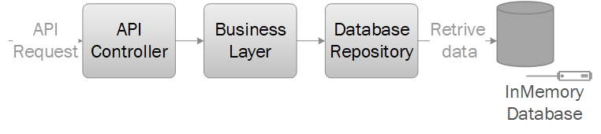

# Moula Payment System

## System Functionality
A payment system where a user has an account with a balance and they can manage
payment requests.

## System Architecture



## Solution Structure

* PaymentSystem.Core - contains all definition of models and interfaces for the system
* PaymentSystem.Business - implementations of business logic 
* PaymentSystem.Repositories - implementations of data repositories
* PaymentSystem.Service - the web api for the payment system
* PaymentSystem.Test - contains all unit tests and functional tests

## To run with docker image

```console
docker pull jianyu734057/paymentsystem
docker run -it -p 3000:80 jianyu734057/paymentsystem
```

swagger api: http://localhost:3000/swagger/index.html

## To run with Terminal

```console
git clone https://github.com/Jay734057/PaymentSystem.git
cd .\PaymentSystem\
dotnet restore
dotnet test
dotnet run --project PaymentSystem.Service
```

swagger api: http://localhost:5000/swagger/index.html or https://localhost:5001/swagger/index.html

## Note
* System is using in-memory database with some dummy data in [json file](PaymentSystem.Service/DummyData/DummyData.json)
* [Dockerfile](Dockerfile) is provided so do deployment directly with docker.
* System contains different appsettings.json for environment configurations.
* Simple unit tests and functional tests are included.
* No logic is put in PaymentBussiness yet as it is not in use for current api endpoint.
* No logic is put in PaymentRepository yet as it is not in use for current api endpoint.
* Run test step is not included in Dockerfile which should be implemented.
  
